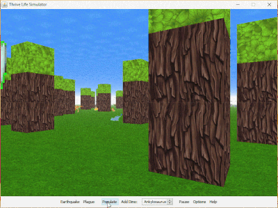

# Thrive Life Simulator
Simulates an ecosystem consisting of trees and various land-dinosaurs in a 3D environment with ways for the user to influence the ecosystem. Made with Bingran Li and Lawrence Pang for ICS4U1 course.

